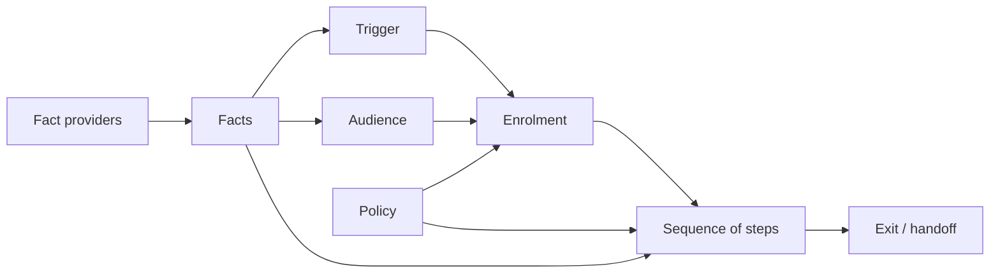
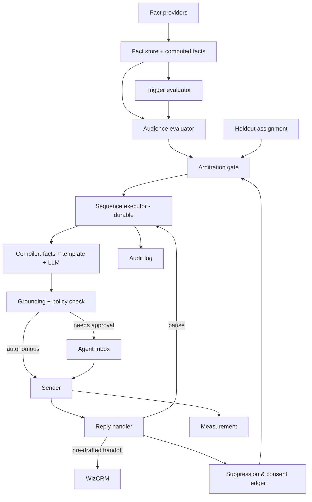

# WizCRM Sales Agents — A Play Engine for Wholesale Revenue

**Status:** Draft for leadership review · **Version:** 3.0 · **Date:** 27 Sep 2026 · **Owner:** Product (WizCRM)
**Supersedes:** v2.1. Content carried over; restructured to the WizCommerce PRD format (KAI PRD).

---

# Business Problem Statement

Wholesale teams lose revenue from demand they **already have**:
- quotes go stale;
- carts are abandoned;
- accounts drift past their own reorder rhythm;
- approved portal accounts never place a first order;
- restocks aren't announced to the buyers who wanted them;
- inbound inquiries wait hours for a reply.

Reps carry 80–400 accounts each and already spend 8–10 hours a week on low-value, repetitive work. They cannot act on every one of these moments consistently and on time.

**WizCRM Sales Agents** is a play engine. It runs pre-built revenue "plays" autonomously, under the rep's name, using WizCommerce's first-party order, quote, cart and portal data. It **offloads rep work rather than creating it**: the agent acts until it genuinely cannot, and when it can't, it hands the rep something nearly finished.

- **Industries:** Home décor / Furniture / Lighting (primary); Fashion & Apparel (emerging); Others
- **ICP:** US B2B wholesalers, distributors and manufacturers; $5M–$50M revenue; 20–200 employees
- **User personas within the org:**
    - Sales Reps (field and inside sales) — the agent sends on their behalf
    - Org Admins (owner, VP Sales, RevOps) — enable, govern and measure

**Why this can win:** generic AI SDRs send cold outbound on scraped data and fail on fabricated facts, generic copy and burned domains. Every play here is **warm and first-party**, triggered by something the buyer did or a change on the supplier's side. WizCommerce is the system of record, so every claim in every email is grounded in data we own.

## Open Questions to resolve

1. Do core-platform webhooks exist for `order`, `quote` and `lead` create/update events? This decides whether P01 (≤5 min response) is possible at launch.
2. Does WizShop expose a cart-creation API or signed deep-link endpoint for one-click reorder and quote-approval links?
3. Sender identity default: the rep's connected mailbox or a tenant ESP domain? (Decision D3)
4. Is AI disclosure required in rep-named emails? (Legal input — Decision D6)
5. Minimum tenant size for Phase 1 participation (e.g. ≥500 active accounts)?
6. Owner and SLA for the live inventory provider.

# What all this document covers

**User stories:**

1. Group 1 — Setting Up: Play Library & Data Readiness
2. Group 2 — Governing: Autonomy, Rules & Safety
3. Group 3 — Selling: Rep Review & Control
4. Group 4 — Engaging: Buyer Replies & Handoffs
5. Group 5 — Operating: Audience Building & Orchestration (engine behaviour)
6. Group 6 — Measuring: Results, Audit & Learning
7. Group 7 — Personalising: Brand Voice & Tenant Content

**Core construct:**

1. **Plays** (curated by WizCommerce, configured by tenants)
    1. Trigger — event, schedule or fact threshold
    2. Audience — rules over facts, with exclusions
    3. Sequence — `email`, `wait`, `branch`, `handoff` steps
    4. Exits and play-to-play handoffs
    5. Policy — priority class, autonomy ceiling, cool-off, tunable parameters
2. **Facts** — the only way data reaches a play
    1. Own (buyer's own history, published terms)
    2. Live (stock, current price, slots — re-read at send)
    3. Cohort (aggregates about other customers — minimum group size)
    4. Restricted (finance, behavioural — selection only, never shown)
3. **Actions**
    1. Autonomous actions — send, reschedule, suppress, exit, pause (earned per play × rep)
    2. Human-in-the-loop actions — draft-and-approve, pre-drafted reply handoffs in WizCRM
4. **Governance & Measurement**
    1. Autonomy levels L0–L4 with warm-up and earned promotion
    2. Holdouts, incremental revenue, audit log

---

# **User Stories**

Priority mapping: **P1** = Phase 0–1 (engine + first five plays), **P2** = Phase 2, **P3** = Phase 3.

### Group 1 — Setting Up: Play Library & Data Readiness

***Letting admins turn plays on safely, without a project.***

1. **US-01: Browse the Play Library (P1)**
As an Org Admin, I want to browse all curated plays, each showing what it does, when it fires, the data it needs, and whether it is **Ready** (all data sources connected) or **Blocked** (with the reason), so that I know what I can switch on today.
2. **US-02: Enable / Disable a Play (P1)**
As an Org Admin, I want to enable or disable any Ready play for my org with one action. In-flight sequences on a disabled play finish their current step and then exit.
3. **US-03: Tune Exposed Parameters (P1)**
As an Org Admin, I want to adjust the parameters WizCommerce has exposed for each play (e.g. P08's start threshold 1.25× interval, allowed 1.1×–1.6×; P13's cart-idle timer 2h, allowed 1–24h) within safe bounds, so the play fits my business without breaking it.
    1. Values outside the bounds are rejected at input.
    2. Logic, steps, templates, risk ceilings and platform rules are **not** tenant-editable in v1.
4. **US-04: Narrow a Play's Audience (P1)**
As an Org Admin, I want to add audience filters (region, store type, rep, lifetime value, a named exclusion list) that only **narrow** who a play reaches, never widen it past the play's own rules or safety checks.
5. **US-05: Audience Preview (P1)**
As an Org Admin, before enabling a play or changing a filter, I want to see a live count of how many contacts it would reach today and a sample list, so I can sanity-check the segment.
6. **US-06: Data Connections Health (P1)**
As an Org Admin, I want to see each data source (orders & quotes, leads, WizShop behaviour, inventory, catalogue tags, wishlist, show calendar) with its connection status, freshness and which plays it unlocks.

|  | Sample Admin scenario |
| --- | --- |
| **Simple** | "Turn on Open Quote Follow-up for my whole team." |
| **Complex** | "Enable Pre-Lapse Cadence but only for accounts in the East region with lifetime spend over $10K, start at 1.4× their usual interval since our furniture customers order infrequently, and exclude the 40 accounts owned by our key-accounts team. Show me who would be enrolled this week before I switch it on." |

---

### Group 2 — Governing: Autonomy, Rules & Safety

***Giving admins control over how independently the agent acts, and guaranteeing it never embarrasses the business.***

1. **US-07: Autonomy Console (P1)**
As an Org Admin, I want to set autonomy ceilings at three scopes — the tenant, each play, and each rep — so that the agent never acts more independently than I allow.

| Level | Behaviour |
| --- | --- |
| L0 | Off / manual-only |
| L1 | Observe only: the play evaluates and logs eligibility, sends nothing |
| L2 | Draft-and-approve: the rep approves every send |
| L3 | Auto-send with exceptions: fallbacks, first-time offers, first touch in 90 days and a 5% audit sample go to the rep |
| L4 | Full auto: every send visible on the timeline; killable |

    The level that applies to any one send is the **lowest** of: the step's sensitivity ceiling, tenant ceiling, play ceiling, rep level, account override, and earned trust.
2. **US-08: Warm-up (P1)**
As an Org Admin, I want my org to start in draft-and-approve (L2) until the first 50 sends have been reviewed, with visible progress ("32 of 50 reviewed, 0 factual errors, 88% approved without edits"). I can extend warm-up or re-enter it after a major change, but cannot skip it.
3. **US-09: Earned Promotion (P1)**
As an Org Admin or rep, I want the system to **offer** a promotion when a play × rep qualifies (L2→L3 after ≥30 approvals with ≥80% approved as-is and no escapes; L3→L4 after ≥100 L3 sends with ≥95% audit pass and kill rate <5%). Promotion is never applied automatically.
4. **US-10: Automatic Demotion & Forced Demotion (P1)**
As an Org Admin, I want the agent to drop one level automatically on a rep kill, a complaint, a factual error, or an edit rate above 40% over 7 days — and I want a one-click override to force any play, rep or the whole org back to draft-only.
5. **US-11: Suppression & Consent (P1)**
As an Org Admin, I want one shared do-not-contact ledger covering:
    1. Automatic rules I can see and tune (open RMA or complaint, AR dispute or credit hold, order in the last 7 days);
    2. Manual entries (contact, account, competitor domain);
    3. System entries (bounces, unsubscribes, spam complaints) that I can view but cannot override.

    Each contact also has a per-channel consent record with source and timestamp, exportable for audit.
6. **US-12: Frequency Caps (P1)**
As an Org Admin, I want a guarantee that no contact receives more than 2 agent emails per rolling 7 days or 5 per rolling 30 days across all plays combined, and that only one play is active per contact at a time.
7. **US-13: Sending Health & Breakers (P1)**
As an Org Admin, I want to see domain authentication status (SPF/DKIM/DMARC), rep mailbox connections, bounce and complaint rates. A 7-day complaint rate above 0.1% drops every play to L2; at 0.3% all sending pauses.

|  | Sample Admin scenario |
| --- | --- |
| **Simple** | "Keep Shrinking Basket at draft-and-approve forever — it's too sensitive." |
| **Complex** | "Dana has been approving Replenishment drafts without edits for a month — promote her to full auto for that play, keep everyone else at L3, drop the whole org back to draft-only during our price-dispute week, and never email anyone at our three competitors' domains." |

---

### Group 3 — Selling: Rep Review & Control

***Keeping reps in control of everything sent in their name, with the least possible effort.***

1. **US-14: Agent Inbox (P1)**
As a sales rep, when a draft needs my approval, I want to see it in one queue with why it exists, a sensitivity badge, and each claim linked to its data source on hover. I can approve, edit and approve, reject with a reason, or snooze.
    1. **Bulk approval** is available only for drafts that show the buyer's own data with no fallbacks.
    2. Time-sensitive plays (Speed-to-Lead, Abandoned Cart, Back-in-Stock) sort to the top.
    3. Drafts expire per play (e.g. 4h for speed plays, 72h for retention). Live data is re-checked if a draft is approved late.
    4. If my queue backs up, the agent stops drafting from the lowest-priority plays upward.
2. **US-15: Account Timeline (P1)**
As a sales rep, I want every agent decision on an account on its WizCRM timeline — enrolled, skipped and why, sent, replied, exited — so I'm never surprised by what a buyer received.
3. **US-16: Account Controls (P1)**
As a sales rep, I want to set an account to manual-only, pause it for N days, exclude it from a specific play, or set the preferred contact.
4. **US-17: Kill Switch (P1)**
As a sales rep, I want to stop any sequence, any account, or my entire book instantly, and reverse it later.
5. **US-18: My Autonomy (P1)**
As a sales rep, I want to choose my own autonomy level per play, up to the admin's ceiling.
6. **US-19: Weekly Digest (P1)**
As a sales rep, I want a weekly summary of what the agent sent, what it handled autonomously, what needed my touch, and results against holdout.

|  | Sample Rep scenario |
| --- | --- |
| **Simple** | "Approve all of today's reorder drafts." |
| **Complex** | "Pause everything on Harbor & Pine for two weeks — they're mid-negotiation with me — set Coastal Living to manual-only permanently, and show me why Marcus at Sagebrook got a winback email yesterday when I spoke to him last week." |

---

### Group 4 — Engaging: Buyer Replies & Handoffs

***The reply is the product. The agent handles what it can; the rep only touches what genuinely needs a human.***

1. **US-20: Instant Pause on Reply (P1)**
As a sales rep, when any buyer replies to an agent email, I want every active play for that contact paused immediately (or for the whole account if the reply is account-wide, e.g. "we've changed suppliers"), so the agent never talks over a real conversation.
2. **US-21: Autonomous Reply Handling (P1)**
As a sales rep, I want the agent to act on replies it can handle **without creating work for me**:

| Classification | Agent does | Rep involvement |
| --- | --- | --- |
| `order_placed` | Exits the play, logs the outcome | None |
| `ooo` | Reschedules past the return date, resumes | None |
| `unsubscribe` | Suppresses the contact everywhere, exits | None |
| `not_now` with a date | Pauses until that date | None |
| `not_now` without a date | Pauses for the play's default cool-off | None |
| `complaint` | Suppresses, exits, flags to admin | Notified in WizCRM; no action required |
| `interested` | Drafts a reply in my voice; pre-builds a cart or quote link if intent is clear | Read, edit if needed, send |
| `question` | Drafts an answer from facts | Read, edit if needed, send |
| `wrong_person` | Pauses; pre-fills a contact-update form with the name/email from the reply | One-click confirm |
| `other` | Drafts a best-effort reply | Read, edit if needed, send |

3. **US-22: Pre-Drafted Handoff in WizCRM (P1)**
As a sales rep, when a reply or a finished sequence needs a human, I want it to arrive in WizCRM with the classified intent, the full thread, a pre-drafted response with every claim linked to its source, and any pre-built cart or quote link — **never a blank canvas.** It must reach me within 15 minutes (p95); complaints within 1 hour.
4. **US-23: Play-level Reply Exits (P1)**
As WizCommerce (play author), I want each play to declare what state its enrolment moves to after each reply classification (exit, pause, pause-until, resume, rep handoff), so reply behaviour is consistent and testable per play.
5. **US-24: Reply Branching (P2)**
As WizCommerce (play author), I want a `branch` step to route on reply classification — e.g. P09's one-click "still buying / different buyer / stop" answers.

|  | Sample buyer-reply scenario |
| --- | --- |
| **Simple** | Buyer replies "I'm out until the 14th." → agent reschedules the next email for the 15th. No rep touch. |
| **Complex** | Buyer replies "Same quantity as last time, but is the brass finish back in stock? Also Jenna handles lighting orders now." → all plays pause; the rep sees a drafted reply confirming the reorder with a pre-built cart, a "let me confirm availability" line (no live stock claim without fresh data), and a pre-filled contact-update form for Jenna. Rep edits one line and sends. |

---

### Group 5 — Operating: Audience Building & Orchestration

***The engine behaviour every play inherits. No play can opt out.***

1. **US-25: Fact-based Audience Building (P1)**
As the system, I build each play's audience by compiling its rules into queries over computed facts (e.g. `median_order_interval`, `cadence_ratio`, `sku_due_date`, `quote_age_days`), with tenant parameters and admin filters applied. Event plays evaluate only the contact that caused the event.
2. **US-26: Arbitration (P1)**
As the system, I run every candidate through, in order: tenant/play/rep enabled → suppression → holdout → one-play-per-contact by priority class → account guard → cool-off → frequency caps. Every rejection is logged with its reason and next-eligible date.

| Priority class | Launch plays |
| --- | --- |
| Live intent | P13 Abandoned Cart, P16 Open Quote, P23 Back-in-Stock |
| Replenishment | P19 SKU Replenishment, P08 Pre-Lapse, P18 Wishlist |
| Time-boxed | P28 Pre-Show Booking |
| Retention | P09 Winback, P11 Shrinking Basket |
| Activation | P03 Registered Never Ordered, P14 Browse Abandonment |
| Discovery | P22 New Arrival Match, P26 Closeout |
| Reactivation | P10 Deep Winback, P05 Dormant Prospect |
| Lead lane (separate) | P01 Speed-to-Lead |

    Higher classes pre-empt lower ones at a step boundary; the lower play resumes later if still eligible.
3. **US-27: Durable Sequences (P1)**
As the system, I run one durable workflow per enrolment that survives restarts, holds timers for weeks, waits on approvals and events, never double-sends, and exits the moment an exit condition is met (e.g. an order is placed mid-sequence).
4. **US-28: Fact-grounded Copy (P1)**
As the system, I write each email from facts only: resolve facts → apply fallbacks (more than 2 fallbacks = don't send) → LLM writes prose in the tenant's voice → every number, date, price and SKU is verified against a fact → policy check (offers, MAP, forbidden/behavioural language, cohort floors, quiet hours, compliance footer).
5. **US-29: Graceful Degradation (P1)**
As the system, when live data is stale or missing, I drop the claim (or the step) instead of guessing. Two consecutive suppressed steps exit the play as `insufficient_evidence`.

|  | Sample engine scenario |
| --- | --- |
| **Simple** | Account has a 42-day reorder rhythm and last ordered 53 days ago → enters P08 today. |
| **Complex** | A contact qualifies for Replenishment, New Arrival Match and Closeout the same week, then abandons a cart → Abandoned Cart pre-empts, Replenishment pauses and resumes after, the other two are queued or dropped, and the contact never receives more than 2 emails that week. |

---

### Group 6 — Measuring: Results, Audit & Learning

***Proving it works, honestly.***

1. **US-30: Incremental Results Dashboard (P1)**
As an Org Admin, I want each play's incremental revenue against a holdout, with confidence intervals and a "not yet significant" state, shown side by side with attributed revenue. Incremental is the headline.
2. **US-31: Enrolment Funnel (P1)**
As an Org Admin, I want each play's funnel — matched → suppressed → holdout → lost to higher priority → capped → enrolled — with the reasons behind each drop.
3. **US-32: "Why?" Audit (P1)**
As a rep or admin, I want to click any send (or non-send) and see exactly why: the trigger, the facts and their values, gate decisions, compile and policy results, approvals and config versions.
4. **US-33: Per-Contact Explanation (P1)**
As a rep or admin, I want to pick any contact and see why they did or didn't qualify for each play.
5. **US-34: Merchandising Brief (P3)**
As an Org Admin, I want a monthly brief rolled up from reply reasons, objections, launch adoption, lost demand from stock-outs and closeout sell-through.

|  | Sample Admin scenario |
| --- | --- |
| **Simple** | "Is Replenishment actually making us money?" |
| **Complex** | "Show me incremental revenue for every live play this quarter versus holdout, which plays are still not significant, how many enrolments each lost to higher-priority plays, and why Open Quote's handoff rate went up last week." |

---

### Group 7 — Personalising: Brand Voice & Tenant Content

***Making every email sound like the distributor, not like WizCommerce.***

1. **US-35: Brand Voice (P1)**
As an Org Admin, I want to set my brand voice with 5–10 example emails, tone guidance, banned phrases and sign-off, and preview it on real accounts.
2. **US-36: Offer Registry (P1)**
As an Org Admin, I want to define the only offers the agent may use (e.g. winback free freight, closeout discounts, price holds) with terms, eligibility and exact start/expiry. The agent cannot invent or extend an offer.
3. **US-37: Claims Policy (P1)**
As an Org Admin, I want to set MAP rules, forbidden language, and cohort minimums (≥10 accounts; ≥25 for reorder rates), which I can raise but not lower.
4. **US-38: Freight, Terms & Calendars (P1)**
As an Org Admin, I want to configure freight threshold, MOQ, opening-order minimum, payment terms, quiet hours, holidays and market-week blackouts.
5. **US-39: "What Changed" Content (P2)**
As an Org Admin, I want a simple form to record what's new (collections, terms, lead times) so reactivation plays have a legitimate reason to re-contact. An empty or stale (>90 days) payload blocks those plays.
6. **US-40: Show Setup (P3)**
As an Org Admin, I want to define shows, booth, dates, draw region and participating reps' bookable slots.

|  | Sample Admin scenario |
| --- | --- |
| **Simple** | "Add free freight through Oct 31 as our winback offer." |
| **Complex** | "Set up our High Point show: booth IH-402, Oct 17–22, Southeast draw region, Dana and Luis each have 16 half-hour slots, and never mention closeout pricing to our designer-channel accounts because of MAP." |

---

# Play Engine — System Design

## 1. Core model



| Concept | Definition |
| --- | --- |
| **Entity** | Lead, Contact, Account, and linked objects (Order, Quote, Cart, SKU, Show). Enrolment subject is a Lead or Contact |
| **Fact** | A named, typed, timestamped value with source, freshness SLA, sensitivity class, render rule and fallback |
| **Trigger** | Event, schedule, or fact threshold |
| **Audience** | Rule over facts plus exclusions |
| **Sequence** | `email`, `wait`, `branch`, `handoff` steps |
| **Exit / Handoff** | Conditions that end the enrolment, optionally moving to another play or to the rep |
| **Policy** | Priority class, max autonomy, cool-off, approval TTL, tunable parameters |

## 2. Fact layer

```yaml
fact: stock_on_hand
entity: sku
type: integer
provider: inventory_feed
freshness_sla: 24h
sensitivity: live           # own | live | cohort | restricted
render: allowed             # allowed | selection_only
fallback: suppress_claim    # suppress_claim | substitute:<fact> | drop_step | block_play
```

| Class | Examples | Max autonomy | Send-time rule |
| --- | --- | --- | --- |
| **Own** | Last order date, usual quantity, quote total, freight threshold | L4 | Must resolve; otherwise apply fallback |
| **Live** | Stock, lead time, current price, open slots | L4 | Re-read at send; dropped if older than freshness SLA |
| **Cohort** | Reorder rate, cohort bestsellers | L3 | Minimum group size; aggregate phrasing only |
| **Restricted** | Balances, credit, revenue decline, view counts, dwell | Never shown | Forced `selection_only` |

A step's risk is the **highest class among the facts it renders** — derived, never declared. Computed facts (e.g. `median_order_interval`, `cadence_ratio`, `sku_due_date`) inherit the most restrictive class of their inputs.

## 3. Play definition schema

```yaml
play: pre_lapse_cadence
version: 4
lifecycle: retention
subject: contact
trigger: {type: schedule, every: 1d}
audience:
  all: [lifetime_orders >= 3, cadence_ratio between param.low and param.high]
  none: [order_in_last_14d, seasonal_buyer]
exit: [order_placed]
play_handoff: {when: cadence_ratio > 2.0, to: winback_90_180}
reply_exits:
  order_placed:  exit
  ooo:           resume
  unsubscribe:   exit
  not_now:       pause_until: {fact: reply_date, fallback: 30d}
  interested:    rep_handoff
  question:      rep_handoff
  wrong_person:  rep_handoff
  complaint:     exit
  other:         rep_handoff
policy:
  priority_class: replenishment
  max_autonomy: L4
  cooloff: 90d
  approval_ttl: 72h
  params:
    low:  {default: 1.25, min: 1.1, max: 1.6}
    high: {default: 2.0,  min: 1.6, max: 3.0}
steps:
  - email: {template: cadence_e1, facts: [top_reorder_sku, median_order_interval, usual_qty, reorder_cart_link]}
  - wait:  {until: cadence_ratio >= 1.4}
  - email: {template: cadence_e2, facts: [new_arrivals_since_last_order]}
  - wait:  {until: cadence_ratio >= 1.6}
  - email: {template: cadence_e3, facts: [stock_on_hand, lead_time_days]}
  - handoff:
      type: rep
      reason: "Account approaching lapse. Agent has sent 3 emails without a response."
      resume_play: false
```

| Step | What it does |
| --- | --- |
| `email` | Compiles and sends or queues a message |
| `wait` | Duration, fact condition or event |
| `branch` | Routes on a fact or reply classification |
| `handoff` | Agent is genuinely stuck; rep gets a pre-drafted reply with full context in WizCRM; play exits or pauses |

**Validation (gates every library change now, and admin-authored plays later):** every fact exists and has a fallback; no `selection_only` fact is rendered; derived step risk ≤ `max_autonomy`; every `wait` has a timeout and every play has an exit; handoffs form no cycles; offers are registry types only; cohort facts carry size guards; all parameters have bounds; required providers are declared.

## 4. Runtime



Deterministic components make every decision. The LLM only writes prose from facts and classifies replies, and always sits behind a deterministic check.

---

# Task Breakdown & Milestones

| Phase | Window | Build | Plays that become Ready |
| --- | --- | --- | --- |
| **0 — Engine** | Wks 0–6 | Fact layer; orders/quotes/leads providers; play schema + validator; arbitration; durable executor; compiler + grounding; Agent Inbox; sender; reply handler; suppression ledger; holdouts; audit; core admin & rep surfaces. Shadow mode on 3 design partners | — (shadow) |
| **1 — Prove it** | Wks 6–10 | Offer Registry; freight/terms config | **P16, P19, P08, P09, P01** |
| **2 — Behaviour + inventory** | Wks 8–20 | WizShop behaviour provider; **live inventory**; cohort engine; catalogue tagging; content facts | **P13, P14, P03, P11, P10, P23, P22** (+ full live steps of P08/P16/P19) |
| **3 — Operational** | Wks 18–32 | Inventory ageing + `Allocation`; show & rep calendar + `Slot`; wishlist | **P26, P28, P18, P05** |

**Phase 1 exit criteria:** pooled incremental lift with CI for ≥3 plays; rep kill rate <5%; rep handoff rate trending down by week 10; zero ungrounded claims; complaints <0.1%; handoffs in WizCRM ≤15 min.

**Critical path:** fact layer → arbitration + executor → compiler + grounding → Inbox + reply handler → first play. Phase 2 critical path: inventory provider.

- Detailed engineering breakdown **to be discussed with Tech.**

# Cross-Team Dependencies

1. **WizOrder / WizCommerce core:** order, quote, lead, account, contact data; event webhooks or CDC; nightly backfill.
2. **WizShop:** carts, sessions, portal accounts, wishlist object (P3); cart-creation API / signed deep links.
3. **WizCRM:** timeline events, handoff surface, contact updates, rep ownership.
4. **Communication & Email Platform:** connected rep mailboxes, suppression and cool-off ledger, templates, compliance footer.
5. **Inventory / ERP team:** near-real-time stock, lead time, restock events; inventory ageing.
6. **WizStudio:** catalogue tagging (category, price band, style) for P22.
7. **Data Warehouse:** computed facts, holdout analysis.

# Product and UX Impacts across systems

## 1. Component Library

**Base scope (P1):**

1. Play Card — name, description, status (Ready / Blocked / Enabled), providers needed, key metric
2. Parameter Control — bounded slider/input with default and range
3. Audience Preview — live count + sample list
4. Enrolment Funnel — stage counts with drill-down reasons
5. Draft Card (Agent Inbox) — rendered email, sensitivity badge, fact-source hovers, approve/edit/reject/snooze
6. Handoff Card (WizCRM) — classification chip, thread, pre-drafted reply, pre-built links, contact-update form
7. Autonomy Matrix — tenant × play × rep levels, trust scores, promotion offers
8. Timeline Event — agent actions on the account timeline with "why?" link
9. Status Badge — Ready, Blocked, Warm-up, Paused, Breaker tripped
10. Results Card — incremental revenue with CI and significance state

**Charts:** Metric Card, Bar Chart (per-play lift), Line Chart (trend), Data Table (enrolments, sends, audit).

**Future scope:** play builder canvas (authoring), A/B variant comparison, merchandising brief views.

## 2. UX Strategy to drive adoption

- **Draft-first by default.** Every tenant starts at L2 so reps see and trust the output before anything goes out unreviewed.
- **Never a blank canvas.** Every item that reaches a rep is pre-drafted; the rep's job is review and send.
- **The agent's work is visible.** Timeline events and the weekly digest make autonomous sends feel like help, not a black box.
- **Controls are always one click away.** Kill switch, pause and manual-only are on every account and every draft.
- **Handoff rate goes down over time.** The digest shows reps how much the agent handled without them.

## 3. Play Library Appendix (launch set)

Full play configurations live in the library repo, not this PRD.

| Play | Subject | Trigger | Priority class | Required providers | Primitives beyond core | Priority |
| --- | --- | --- | --- | --- | --- | --- |
| P01 Speed-to-Lead | Lead | Event | Lead lane | Leads, config | — | P1 |
| P08 Pre-Lapse Cadence | Contact | Threshold | Replenishment | Orders (inventory optional) | Fact-condition waits; `handoff` | P1 |
| P09 Winback 90–180 | Contact | Schedule | Retention | Orders, Offer Registry | `branch` on reply | P1 |
| P16 Open Quote | Contact | Schedule | Live intent | Quotes (inventory optional) | — | P1 |
| P19 SKU Replenishment | Contact | Threshold | Replenishment | Orders (inventory optional) | — | P1 |
| P03 Registered, Never Ordered | Contact | Schedule | Activation | WizShop, config | — | P2 |
| P10 Deep Winback | Contact | Schedule | Reactivation | Orders, content facts | `branch`; contact-update form | P2 |
| P11 Shrinking Basket | Contact | Schedule | Retention | Orders, cohort, tagging | `branch` on reply | P2 |
| P13 Abandoned Cart | Contact | Event | Live intent | WizShop, config | — | P2 |
| P14 Browse Abandonment | Contact | Event | Activation | WizShop, cohort | `play_handoff` to P13 | P2 |
| P22 New Arrival Match | Contact | Event/batch | Discovery | Orders, tagging | — | P2 |
| P23 Back-in-Stock | Contact | Event | Live intent | Inventory | — | P2 |
| P05 Dormant Prospect | Lead | Schedule | Reactivation | Leads, content facts | — | P3 |
| P18 Wishlist | Contact | Event | Replenishment | Wishlist, inventory | — | P3 |
| P26 Closeout | Contact | Event | Discovery | Inventory ageing, Offer Registry | `Allocation` | P3 |
| P28 Pre-Show Booking | Contact | Calendar | Time-boxed | Show & rep calendar | `Slot` | P3 |

**Generality check:** all 18 excluded plays (P02, P04, P06, P07, P12, P15, P17, P20, P21, P24, P25, P27, P29–P34) can be expressed in this schema. Every gap is a fact provider, not a new runtime concept. Restricted-class plays (P31, P32) are forced to L2 by the schema.

# Sales Agents Performance Tracking (Internal and External)

#### Internal — Engineering & Product Observability

1. **Trace logging:** trigger → audience match → gate decisions → fact resolutions (value, source, freshness) → compile → grounding result → policy result → approval/auto → send → reply → classification → outcome. Play version and prompt version hash on every trace.
2. **Grounding monitor:** escaped ungrounded claims (target 0); fallback rate per fact (target <15%).
3. **Latency budgets:** P01 time-to-first-touch ≤5 min; P13/P23 event-to-send ≤10 min; reply-to-handoff ≤15 min p95; complaint escalation ≤1h.
4. **Alerting:** complaint rate >0.1% (7-day); bounce >2%; provider freshness breach; runaway enrolment (play matching an outsized share of a tenant); classifier recall on complaint/unsubscribe <98%.
5. **Drift & regression:** pinned LLM versions; golden-account regression suite runs before every library or prompt release.

#### External — User-Facing Quality & Outcomes

1. **Per play:** enrolments, sends, autonomous actions, reply and positive reply rate, conversion, incremental revenue per 1,000 sends, rep handoff rate (should fall over time), rep kill rate (<5%).
2. **Business:** pooled incremental revenue vs holdout (headline); play-specific primary outcome (e.g. `quote_converted`, `sku_reordered`).
3. **Feedback loops:** rep edit diffs classified as factual (triggers fact-resolver review) or stylistic (feeds voice tuning); reject reasons.
4. **Anti-metrics:** open rate and email volume are not optimised.

# Guardrails (platform rules no play can bypass)

| Rule | Enforcement point |
| --- | --- |
| One active play per contact; priority by class | Arbitration gate |
| 2 emails / 7 days, 5 / 30 days per contact | Gate + re-check at send |
| Any human reply pauses all plays | Reply handler |
| Restricted facts never rendered | Validator + compiler (never passed to LLM) |
| Every number, date, price, SKU traced to a fact | Grounding verifier |
| Live facts re-read at send, dropped if stale | Compiler |
| >2 fallbacks in a step = don't send | Compiler |
| Offers only from the registry, honoured exactly | Policy check |
| MAP, forbidden and behavioural language | Policy check |
| Cohort claims only above minimum group size | Policy check |
| Quiet hours, business hours, local timezone | Scheduler |
| Compliance footer (sender, address, one-click unsubscribe) | Policy check |
| Complaint breakers 0.1% / 0.3% | Sender |
| 10% program holdout + 10% per-play holdout | Arbitration gate |
| Replies never trigger autonomous sends | Reply handler |

# Organisation Settings

- Play Library enablement, parameters and audience filters (per tenant)
- Autonomy ceilings and warm-up state
- Brand voice, Offer Registry, claims policy, freight & terms, calendars
- Sending domains and mailbox connections
- Subscription and tiered pricing **to be filled post closure on Org-setting PRD and Pricing Tier conclusion**

# User Management

- **Slugs to be defined at roles level (to be filled post closure on Org-setting & UMS PRD):**
    - View, Enable, Configure — Play Library
    - View, Edit — Autonomy Console
    - View, Approve, Edit, Reject — Agent Inbox (own book / team)
    - View, Edit — Tenant Content (voice, offers, claims, terms)
    - View, Add, Remove — Suppression & Consent
    - View — Results & Audit Log
    - Kill switch — own book (rep); any book (admin)

# Integrations and Connectors

- **Email:** Google Workspace (Gmail API), Microsoft 365 (Graph) via OAuth send scopes; ESP fallback (Postmark/SES) on the tenant domain
- **Calendar:** Google / Microsoft calendars for P28 slots (P3)
- **ERP / Inventory:** stock, lead time, restock events, inventory ageing (P2/P3)
- **LLM:** Claude API, version-pinned
- **Durable execution:** Temporal (or equivalent)
- **WhatsApp / SMS:** not in v1; consent model built now

# WizCRM User Interface for Sales Agents

### Entry points

1. **"Sales Agents"** in the WizCRM side menu, expanding to:
    1. Agent Inbox (reps)
    2. Handoffs (reps) — pre-drafted replies needing a human
    3. Play Library (admins)
    4. Autonomy (admins)
    5. Tenant Content (admins) — Voice, Offers, Claims, Terms, Calendars
    6. Data Connections (admins)
    7. Sending (admins)
    8. Suppression & Consent (admins)
    9. Results (admins; reps see their own book)
    10. Audit Log
2. **Account / Customer detail page:** agent events on the timeline; account controls (manual-only, pause, exclude from play, preferred contact); kill switch; "Why?" on every event.
3. **Top nav badge:** count of drafts awaiting approval and handoffs awaiting a reply.
4. **Weekly digest:** emailed to each rep and viewable in WizCRM.

# SSRM with Export & Filters

- Agent Inbox, Handoffs, Enrolment Funnel drill-downs and Audit Log are server-side row-model tables with filters (play, rep, status, classification, date), sort and CSV export.

# Payments

- NA. No finance content is rendered in v1. AR hold and credit hold are used only as suppression inputs.

# Data Warehouse (BigQuery)

- Computed facts, enrolment/send/reply/outcome events, holdout assignments and pooled incremental analysis (stratified by tenant, CUPED variance reduction).
- **Schema and pipeline to be filled by Tech.**

# Rollout Strategy

1. Phase 0: shadow mode (no sends) on 3 design partners for 2+ weeks; validate audiences and drafts against rep judgement.
2. Phase 1: go live at L2 (draft-and-approve) with P16 first, then P19, P08, P01 (after reply handler is proven), then P09.
3. Promote to L3/L4 per play × rep only as trust is earned.
4. Expand to 6–10 tenants by week 6 so pooled holdout results are meaningful by week 10.
5. **Final rollout plan TBA post business sign-off.**

# Pricing

- TBD. Outcome-based pricing depends on the holdout design (Decision D2).

# Demo and Enablement

- End-to-end prototype on **synthetic tenant data**: mock core service emitting events, synthetic accounts/orders/quotes/leads with known-correct scenarios, simulated clock, Mailpit for sent mail, and a buyer simulator that replies, orders or unsubscribes.
- **Design partner accounts:** to be selected from the ICP (home décor, furniture, lighting; ≥500 active accounts).

# Risk, Open Questions, and Decisions

**Risks**

| Risk | Mitigation |
| --- | --- |
| Over-generalising into a workflow tool nobody asked for | Schema scoped to the 16 plays; excluded plays used only to test generality; no builder UI in v1 |
| Weak fact quality breaks many plays at once | Provider health gates readiness; fallback rate per fact; data-health score |
| Reps feel the agent creates work | Draft-first warm-up; handoffs always pre-drafted; handoff rate tracked and expected to fall |
| Underpowered measurement | Cross-tenant pooling, CUPED, program holdout |
| Inventory provider slips | Phase 2 ships behaviour plays first; live steps degrade gracefully |
| Deliverability incident | Auth preflight, mailbox ramp, breakers |
| LLM drift | Pinned models; grounding independent of the model; golden-account regression |
| Dependency on Comms Platform | Joint roadmap; minimal shim if delayed |

**Decisions**

| # | Decision | Recommendation / Status |
| --- | --- | --- |
| D1 | Play authorship | **Decided:** curated now, authoring later |
| D2 | Holdout design & customer promise | Program + pooled per-play holdouts; lead-level holdout for P01 |
| D3 | Sender identity | Rep mailbox default; ESP fallback; named house sender for unassigned leads |
| D4 | Cap exemptions | Only P01's first email is exempt from the weekly cap |
| D5 | Cohort facts | Tenant-only cohorts in v1 |
| D6 | AI disclosure | Legal input; tenant-configurable footer by default |
| D7 | Inventory provider SLA | ≤15 min for restock events; nightly for ageing |
| D8 | Library release cadence | Monthly, with versioned changelogs |
| D9 | Rep task creation | **Decided:** no standalone tasks; only pre-drafted handoffs in WizCRM |

# Prototype Link & Training Video Link

- **To be added once the synthetic-data prototype is deployed.**
